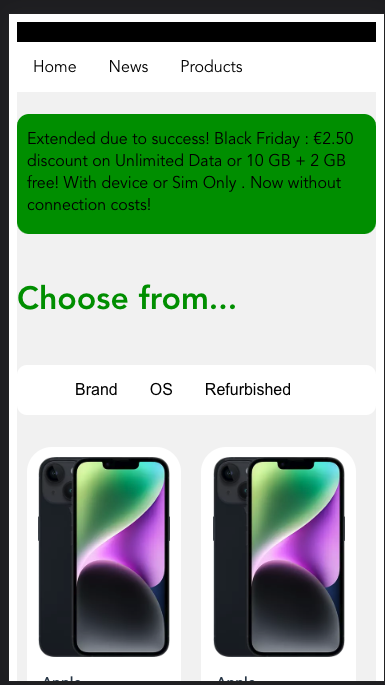

# Pathe Thuis

A Vuejs Project to show the list of Mobile phones available in THE MOBILE STORE. Allow the user to filter for their favorite phone by Brand, OS and Refurbished.

# Application URL
https://the-mobile-store-test.netlify.app/

# Application Structure
List of views, component and route used in the application
# Views
   1. HomeView
        - The landing component of the application. The home component shows the list of mobile phones available to the user
        - The dashboard provides a tool bar with filter options such as Brand , OS and Refurbhished
        - Dashboard provides show information such as
            - Brand of the Phone
            - Model Name

# Route Information

The Application has two routes 
1. HomeView 
    - This is the default route to the application
    - Loads the list of all mobile phones available
    - Component/view: HomeView

# Styling
- Css (scoped) styling used on component level and view level


# Unit Testing


# Improvements to the current approach
Technical
- Enable Typescript support to the project
- Enable Unit test
- Enable support of scoped style sheet

Feature
- Different styling for auto-complete of search
- Make it more responsive
- Better Result Not Found page
- Internationalization
- Dark & Light theme


# Resources
- Internationalization
https://santhoshkumarravi.medium.com/vue-js-internationalization-87623bbb41e8

- Filters
https://santhoshkumarravi.medium.com/vue-js-filters-a72929ba5aa1

- Custom Directives
https://santhoshkumarravi.medium.com/vuejs-custom-directives-tool-tip-b5eef501fec8

- Async / Dynamic Components
https://santhoshkumarravi.medium.com/vuejs-async-dynamic-components-7bab7bb8b3b4

- Conditional Rendering
https://santhoshkumarravi.medium.com/vue-js-conditional-rendering-c39bb8ac2470

- Props Validation
https://santhoshkumarravi.medium.com/vue-js-props-validator-c41ff5a6818a

- Vue PWA 
https://santhoshkumarravi.medium.com/vue-pwa-disable-5463e44b1f7f

## Source code checkout 
https://github.com/santhoshkumarravichandran/pathe
-https://santhoshkumarravi.medium.com/vue-pwa-disable-5463e44b1f7f


## Local setup

``` bash
# install dependencies
yarn install

# serve with hot reload at localhost:8080
yarn dev

# build for production with minification
yarn build --prod

# build for production and view the bundle analyzer report
yarn build --report

# run unit tests
yarn unit

# run all tests
yarn test

# run lint
yarn lint 

# run lint --fix
yarn lint  --fix
```

## Application Design

HomeScreen


MobileView
